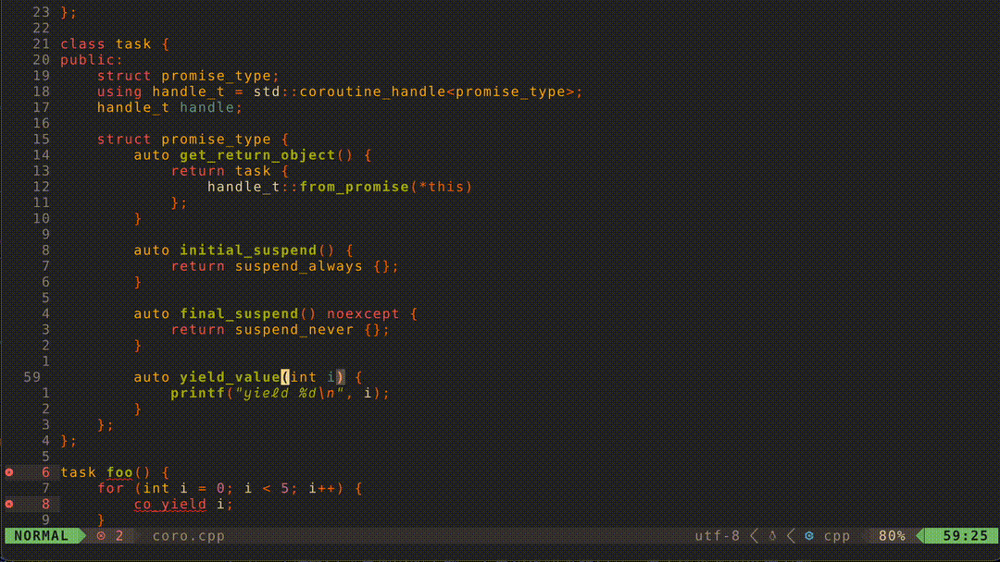

# A Window Local Search Plugin

This plugin enables you to have a search pattern in each window, 
and they can be highlighted simultaneously.

It makes the vim search pattern to be window local, even though it's actually global.



### Setup

On lazy.nvim for example, 
```lua
{
  "xiaoqixian/winlocal-search.nvim",
  config = require("wl-search").setup
}
```

### Default Configurations

```lua
local default_config = {
  enabled = true,
  keep_hl_on_leaving = true,
}
```

- enabled: is the window local search enabled.
- keep_hl_on_leaving: should the window local search highlight be kept when you leave the window.

You can overwrite these options in setup.
